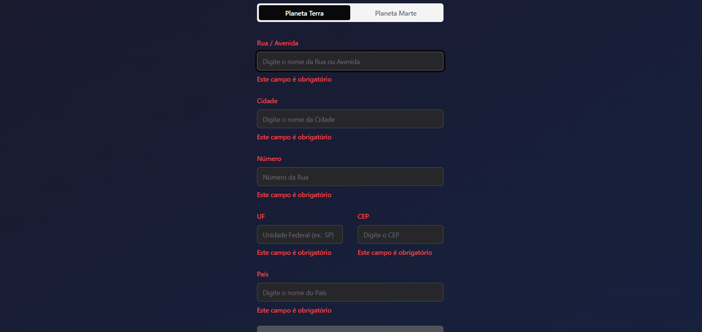

# Bem vindo(a) ao Planet Delivery
### Seu sistema de delivery interplanetário

### Após clonar o repositório

No diretório raiz do projeto execute os comandos:

- `npm install` para instalar as dependências
- `npm run dev` para subir a aplicação
- Acesse o endereço da aplicação fornecido pelo vite ex.: `http//localhost:5173/`

### Tecnologias

- React.JS (vite)
- React-router
- Shadcn ui
- Tailwind CSS
- React hook form
- Zod

